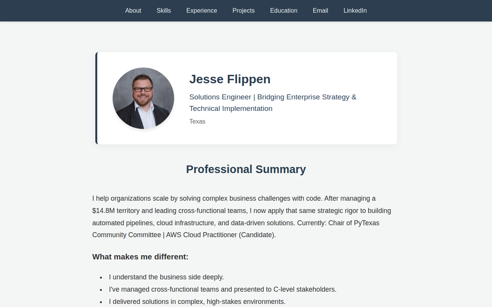

# Jesse Flippen - Solutions Engineer Portfolio

A responsive personal portfolio website designed to showcase my experience as a Solutions Engineer bridging enterprise strategy and technical implementation.

## Overview

This project serves as my digital business card and professional portfolio. It highlights my background in sales operations and my transition into technical solutions engineering. The site is built with a focus on performance, clean design, and clear communication of value.

## Features

*   **Responsive Design**: Optimized for desktop, tablet, and mobile devices.
*   **Professional Summary**: clearly articulated value proposition and key differentiators.
*   **Categorized Skills**: Technical skills organized by domain (Languages, Cloud, BI, Expertise).
*   **Project Showcase**: Projects presented in a Problem-Action-Result (PAR) format.
*   **Social Integration**: Quick access to LinkedIn and Email via FontAwesome icons.
*   **Resume Download**: prominent Call-to-Action for downloading the PDF resume.

## Tech Stack

*   **HTML5**: Semantic markup.
*   **CSS3**: Custom styling, Flexbox/Grid for layout, and CSS variables for theming.
*   **JavaScript**: Light interactivity.
*   **FontAwesome**: Iconography.

## Setup & Usage

No build process is required. This is a static site.

1.  Clone the repository.
2.  Open `index.html` in your preferred web browser.

## Contact

*   **Email**: [jss.flppn@gmail.com](mailto:jss.flppn@gmail.com)
*   **LinkedIn**: [Jesse Flippen](https://linkedin.com)
